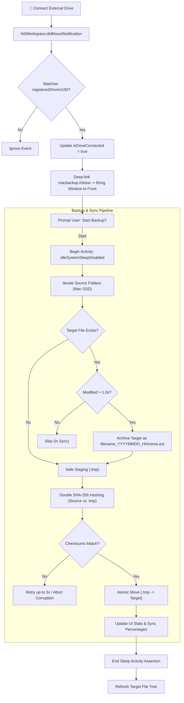

# MacBackup Architecture & Design 🏗️

This document details the internal design, components, and data flow of **MacBackup**.

---

## 1. High-Level Architecture Flow

---

## 2. Core Components

### `MacBackupApp.swift`
- **Application Entry Point**: Configured as a dual-mode SwiftUI `App`.
- **Menu Bar Accessory Mode**: Default activation policy set to `.accessory`. Renders an `externaldrive` icon in the macOS menu bar with real-time green/red drive connection indicators.
- **Dynamic Window Promotion**: Uses an `NSApplicationDelegate` (`AppDelegate`) observer pattern listening to `NSWindow.didBecomeMainNotification` and `NSWindow.willCloseNotification`. Promotes the app to `.regular` policy (showing Dock icon) when a window opens, and demotes back to `.accessory` when closed.
- **URL Scheme Handling**: Registers `macbackup://show` to activate and foreground the app when a registered drive is plugged in.

### `BackupManager.swift`
The central engine of the application (`ObservableObject`), responsible for:
1. **Drive Registration & Tracking**:
   - Stores `registeredDriveUUID` in `@AppStorage`.
   - Listens to `NSWorkspace.didMountNotification` and `NSWorkspace.didUnmountNotification`.
   - Identifies mounted drives by inspecting `URLResourceKey.volumeUUIDStringKey`.
2. **Fail-Safe Incremental Backup**:
   - Uses `ProcessInfo.processInfo.beginActivity([.userInitiated, .idleSystemSleepDisabled])` to disable idle sleep during backups.
   - Computes relative paths from source directory hierarchies and mirrors them onto the target.
   - **Timestamp Archiving**: If a file exists on the target and has been modified, moves the existing target file to `[name]_[YYYYMMDD_HHmmss].[ext]` before copying the new one.
   - **Safe Staging**: Copies the source file to `target.tmp`.
   - **Integrity Verification**: Reads files in 1 MB chunks through Apple's `CryptoKit.SHA256`. Only atomically moves `target.tmp` to `target` if hashes match exactly.
   - **Fault-Tolerant Retries**: Wraps disk I/O in a `performWithRetry` loop (up to 3 attempts with 1s sleep).
3. **Hierarchy & Orphan Detection**:
   - Scans the backup drive recursively via `buildTree()`.
   - Checks if each target file still exists in any of the configured source folders.
   - If not found in sources, flags the node as `isOrphaned = true`.
4. **Drive Ejection**:
   - Locates the volume root using `URLResourceKey.volumeURLKey` and invokes `NSWorkspace.shared.unmountAndEjectDevice(at: volumeURL)`.

### `ContentView.swift`
- **Dual-Pane Split View**: SwiftUI `NavigationSplitView` with a sidebar for settings/status and a main detail view.
- **Sidebar**:
  - Source directory picker (`NSOpenPanel`).
  - Target drive selector & registration.
  - Live drive connection and eject button.
  - "Start Backup" action with sync percentage visual indicator.
- **Main Detail View**:
  - Hierarchical `List` displaying files, sizes, and red `(Orphaned)` tags.
  - Detail preview pane with file icons, modification dates, and size formatters.
  - Single-item and bulk selection deletion triggers.

---

## 3. Data Safety & Integrity Model

| Failure Mode | Mitigation in MacBackup |
| :--- | :--- |
| **System Sleep Mid-Transfer** | Prevented via `ProcessInfo.processInfo.beginActivity` system sleep assertion. |
| **Accidental Overwrite of Prior Versions** | Old target files are timestamp-renamed (`_YYYYMMDD_HHmmss`) before new file write. |
| **Bit Rot / Incomplete Writes** | Written to `.tmp`, double-checked with SHA-256 before atomic replacement. |
| **Transient Drive Disconnect / I/O Glitch** | File operations retry up to 3 times before terminating. |
| **Dirty Drive Removal** | One-click clean volume unmount via `NSWorkspace.unmountAndEjectDevice`. |

---

## 4. Build & Distribution System

- **Compiler**: Swift Package Manager target configured for Apple Silicon (`arm64-apple-macosx`).
- **Packaging Pipeline**:
  - Extracts 1024x1024 artwork from `assets/AppIcon.png`.
  - Generates multi-resolution iconset via `sips` and compiles `.icns` via `iconutil`.
  - Assembles standalone `.app` bundle with `Info.plist` setting `LSArchitecturePriority` to `arm64`.
  - Packages compressed read-only DMG with `/Applications` symlink via `hdiutil create -format UDZO`.
- **CI/CD Automation**: GitHub Actions workflow ([`.github/workflows/build.yml`](file:///.github/workflows/build.yml)) triggers exclusively on release tags (`v*`, numeric) to compile, package, and publish releases automatically.
