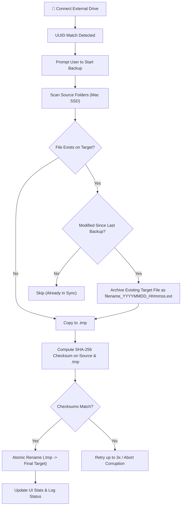

# MacBackup 💾

[](LICENSE)
[](https://www.apple.com/macos/)
[](https://swift.org)
[](https://github.com/rituparnaprof/macbackup/actions/workflows/build.yml)

**MacBackup** is a sleek, lightweight macOS menu bar utility built in SwiftUI for fast, fail-safe backups from your Mac SSD to external storage (USB drives or external SSDs). It features automatic drive detection via Volume UUID, atomic file verification with SHA-256 checksums, versioned backups for modified files, orphaned file detection, and in-app drive ejection.

---

## ✨ Features

- 🔌 **Plug-and-Prompt Auto-Detection**:
  - Registers external storage volumes using unique Volume UUIDs.
  - Automatically detects when your registered drive is connected (`NSWorkspace.didMountNotification`) and prompts you to start backing up immediately.
  - Deep-link integration (`macbackup://show`) activates the window automatically upon connection.

- 🛡️ **Fail-Safe Incremental Sync & Versioning**:
  - Compares file timestamps to transfer only new and modified files.
  - **No accidental overwrites**: When a source file is modified, the previous version on the backup target is automatically preserved with a timestamp (`filename_YYYYMMDD_HHmmss.ext`) before the new file is copied.

- 🔒 **Cryptographic SHA-256 Verification & Atomic Writes**:
  - Every file is first written to a temporary staging file (`.tmp`).
  - SHA-256 checksums are computed for both the source and target files and compared bit-by-bit.
  - Only successfully verified files are atomically moved into their final location.

- 🔁 **Automatic Retry Mechanism**:
  - Retries failed file operations up to 3 times before raising an alert, gracefully handling transient I/O hiccups.

- ☕ **System Sleep Prevention**:
  - Employs `ProcessInfo.processInfo.beginActivity([.userInitiated, .idleSystemSleepDisabled])` to prevent macOS from falling asleep during long transfers.

- 🌳 **Backup File Tree & Orphan Detection**:
  - Explores the file structure on your backup drive with a hierarchical tree view.
  - Detects **orphaned files** (files existing on the backup disk that were deleted from your Mac SSD), highlighting them in red with an `(Orphaned)` tag.
  - Supports quick file previews, single-file deletion, and batch deletion with safety confirmation dialogs.

- ⏏️ **One-Click Safe Eject**:
  - Safely unmounts and ejects the target storage drive directly from the UI using `NSWorkspace.shared.unmountAndEjectDevice`.

- 🎛️ **Native macOS Menu Bar & Split View**:
  - Operates as a discreet menu bar accessory with real-time drive connectivity (green/red indicators) and one-click quick actions.
  - Dynamic activation policy transitions seamlessly between menu bar accessory mode and full window mode.

---

## 📋 Requirements

- **Operating System**: macOS 13.0 (Ventura) or later
- **Architecture**: Apple Silicon (M1/M2/M3/M4) and Intel (x86_64)
- **Toolchain**: Swift 5.9+ / Xcode 15+ (for compiling from source)

---

## 🚀 Getting Started

### 1. Build & Run from Source

Clone the repository and run:

```bash
git clone https://github.com/rituparnaprof/macbackup.git
cd macbackup

# Build in debug mode
swift build

# Run directly
swift run MacBackup
```

### 2. Download or Build the DMG Installer

- **Automated CI/CD Builds**: Every push and pull request automatically triggers GitHub Actions to compile the app and assemble `MacBackup.dmg`. You can download the latest ready-to-use installer `.dmg` directly from the **Actions** tab artifacts in the GitHub repository.
- **Local Release Build**: To build the optimized release binary on your Mac:
  ```bash
  swift build -c release
  ```

---

## 🛠️ How It Works



---

## 📖 Usage Guide

1. **Launch MacBackup**:
   - The app runs in your menu bar (`externaldrive` icon) with a green/red connection status indicator.
   - Click **Show Mac Backup UI** from the menu bar to open the main window.

2. **Select Source Folders**:
   - In the sidebar under **Source Folders (Mac SSD)**, click **Select Source Folders** to select which folders on your Mac you want backed up.
   - Settings are automatically saved across sessions.

3. **Select & Register External Backup Drive**:
   - Plug in your external SSD or USB drive.
   - In the sidebar under **Target (USB Drive)**, click **Select & Register Target Folder**.
   - Select the target destination folder on your drive. MacBackup records the drive's unique volume UUID for automatic detection.

4. **Run Backup**:
   - Click **Start Backup**. MacBackup prevents sleep, verifies checksums, preserves previous versions, and tracks real-time progress.

5. **Manage Backed Up Items**:
   - Inspect files in the hierarchical file tree.
   - Items marked with `(Orphaned)` represent files that were deleted from your Mac. You can preview them, keep them, or batch-delete them using the trash action.

6. **Safely Eject**:
   - When finished, click the **Eject** button in the sidebar to safely unmount the drive before unplugging.

---

## 🤖 Continuous Integration

MacBackup includes a GitHub Actions workflow (`.github/workflows/build.yml`) that runs on `macos-latest`:

- Validates Swift build in Release mode.
- Compiles the application bundle and packages it into `MacBackup.dmg`.
- Uploads the resulting `MacBackup.dmg` installer directly as a build artifact for every push and pull request.

---

## 📄 License

This project is licensed under the **GNU General Public License v3.0 (GPL-3.0)**. See the [LICENSE](LICENSE) file for the full license text.

```text
MacBackup
Copyright (C) 2024-2026 MacBackup Contributors

This program is free software: you can redistribute it and/or modify
it under the terms of the GNU General Public License as published by
the Free Software Foundation, either version 3 of the License, or
(at your option) any later version.

This program is distributed in the hope that it will be useful,
but WITHOUT ANY WARRANTY; without even the implied warranty of
MERCHANTABILITY or FITNESS FOR A PARTICULAR PURPOSE.  See the
GNU General Public License for more details.
```
